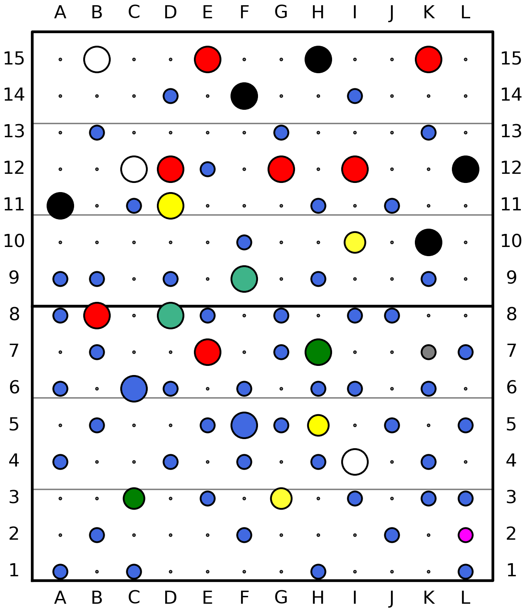

# My Bouldering Home Wall
This is my setup as of 240512.

# Routes

| Name | Grade | Tag |
| ---- | ----- | --- |
| [Potential 6C](/markdowns/240512_Potential_6C.md) | 6C | light blue |
| [Isi Cheezy](/markdowns/240512_Isi_Cheezy.md) | 6A | red |
| [Day 1 Fun](/markdowns/240512_Day_1_Fun.md) | 6B | green |

# Statistics
## Wall Statistics

| - | Nr. | % | 
|---|---|---|
| Einschlagmuttern | 180  | 100% |
| Griffe           |  77 |  43% |

|Grifffarben | Nr. | % |
|---|---|---|
|      blue |  52 |68%|
|       red |   7 | 9%|
|     black |   5 | 6%|
|     white |   3 | 4%|
|     green |   2 | 3%|
|      mint |   2 | 3%|
|    yellow |   2 | 3%|
|      neon |   2 | 3%|
|      grey |   1 | 1%|
|   magenta |   1 | 1%|

|Griffgrößen | Nr. | % |
|---|---|---|
|         S |  52 | 68% |
|         L |  21 | 27% |
|         M |   4 |  5% |
